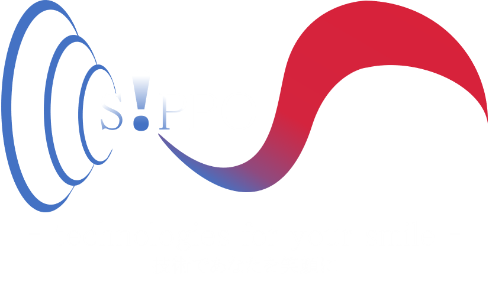
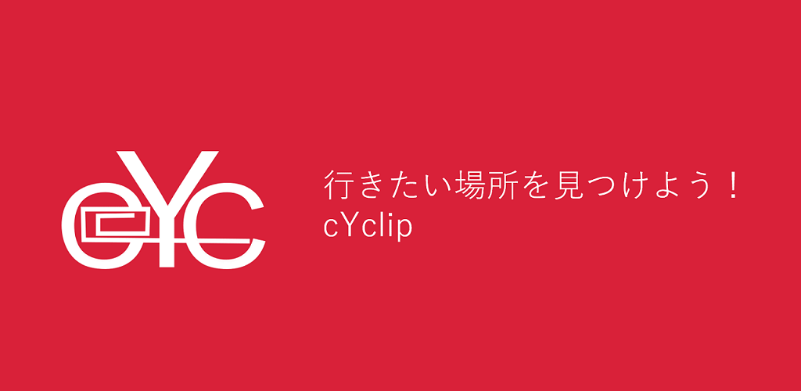

  
  
  私たちは、人々がより充実した生活を過ごすための技術を開発するチームです。  
  
    
<!--[NEWS](https://team-sippo.github.io/)  
[ABOUT US](https://team-sippo.github.io/)  
[PRODUCTS](https://github.com/Team-SIPPO/Team-SIPPO.github.io/products.md)-->  

[■REPOSITORY■](https://github.com/Team-SIPPO?tab=repositories)  
[■MOVIE■](https://www.youtube.com/channel/UCV285Ke2ubPht54D4sOOsqw)  
[■BLOG■](https://knalaboratory.hatenablog.com/)  
[■CONTACT US■](<mailto:team.sippo@gmail.com>)  
## ■PRODUCTS■□■□■□■□

  

  
cYclipはどんどん自転車にのりたくなるアプリです。  
ダッシュボードで行きたい場所を選ぶとルートを生成してくれます。  
ダッシュボードにはAIキャラクターたちのおすすめスポットが表示される機能を開発中です。  
  
  
## ■comming soon...  
  
  
  
★Cheeeez  

  

  
写真をとることに疲れ、今を楽しめないのはもったいない。  
Cheeeez（仮）は大切な瞬間を逃さない自動映えシーン認識/記録アプリです。  
空中から良い角度でシーンを記録します。  
  
  
★Flyable service  

  

  
自分のやりたいことに意識を集中したい  
傘、ナビ、カメラ…煩わしい動作から手を解放するフライアブルサービスを開発中です。
  
  
## ■MEMBER■□■□■□■□■□  
  
[TAN2](https://twitter.com/TatsuyaMori3)  
【Technology Designer】  
♪ビジョン策定  
♪コア技術開発  

  
B.B(Ph.D.)  
【Service Design Architect】  
♪コア技術開発  
♪アプリケーション実装  
  
  
K(Ph.D.)  
【Business Development Director】  
♪メカ技術開発  
♪ビジネスモデル策定  
  
  
[おみー](https://twitter.com/MTRunners)  
【Technology Artist】  
♪デザイン・音楽  
♪ソフトウェア品質管理  
♪知的財産管理  
  

T  
【Dream Conductor Unaffiliated Director】  
♪営業  
♪ビジネスアドバイザ  
  
## ■□■□■□■□■□■□■□■□
